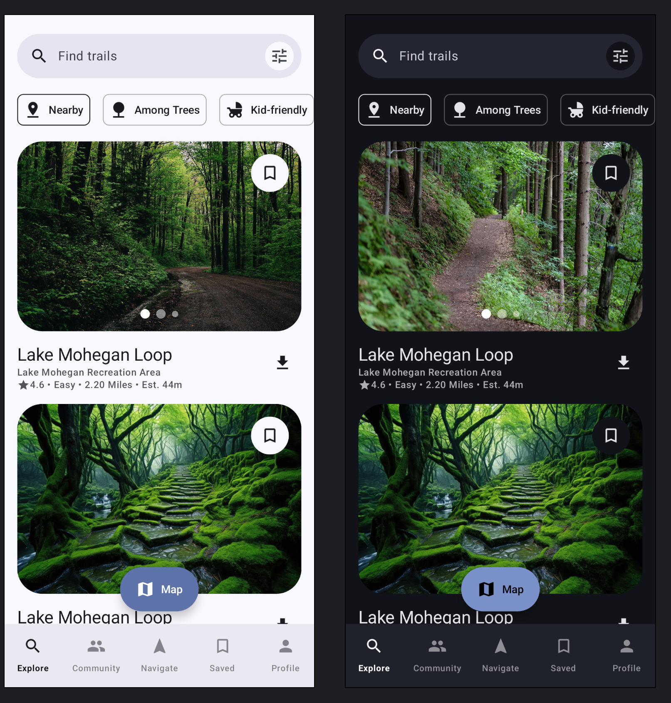

# Welcome to AllTrailsClone!

## 📜 Description
Hi!
This project is a small ui challenge

## 🛠 Built With
|----------------   |------------------------------    |
|     UI Framework  | [Jetpack Compose](https://www.jetbrains.com/lp/compose-multiplatform/)         |                        |
<br>

<h2 align="left">Screenshots</h2>
<h4 align="start">

<br>


## License

```
   Copyright (C) 2024-2025  Mahdi Porkar

    This program is free software: you can redistribute it and/or modify
    it under the terms of the GNU General Public License as published by
    the Free Software Foundation, either version 3 of the License, or
    (at your option) any later version.

    This program is distributed in the hope that it will be useful,
    but WITHOUT ANY WARRANTY; without even the implied warranty of
    MERCHANTABILITY or FITNESS FOR A PARTICULAR PURPOSE.  See the
    GNU General Public License for more details.

    You should have received a copy of the GNU General Public License
    along with this program.  If not, see https://www.gnu.org/licenses/.
```
